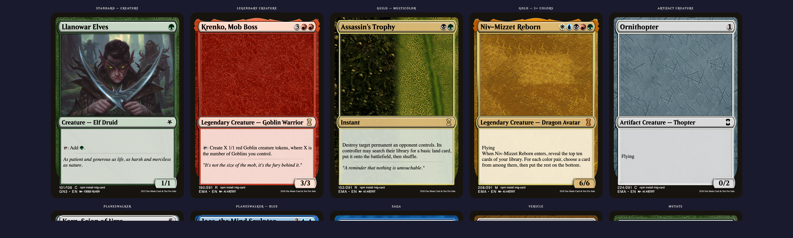
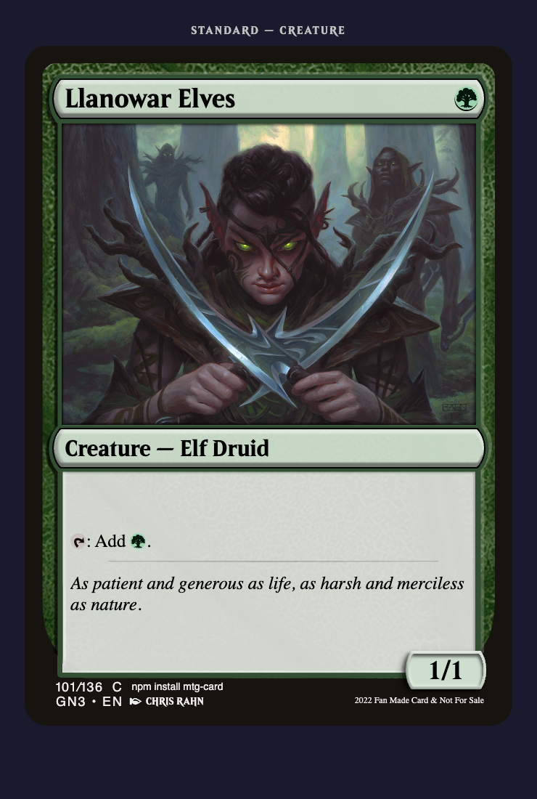

# mtg-card

A React component that renders pixel-perfect Magic: The Gathering cards entirely in the browser. No canvas, no images of card frames — just SVG layers, CSS theming, and one `<MtgCard />` component.



## Why this library?

- **Zero card-frame images** — Every part of the card frame (borders, fields, edges, P/T box) is an inline SVG themed with CSS custom properties. Colors adapt automatically to the mana cost.
- **Automatic color theming** — Pass `manaCost={['R', 'G']}` and the card renders with the correct Gruul dual-color frame, texture, and field tints. Mono, dual, tri+, gold, artifact, colorless, and land frames all work out of the box.
- **All major frame types** — Standard creatures, noncreature spells, planeswalkers, sagas, vehicles, adventures, mutate, basic lands, and nonbasic lands.
- **Dynamic set symbols via CDN** — Pass a `setCode` and `rarity` to fetch the real set icon at runtime from [mtg-vectors](https://github.com/Investigamer/mtg-vectors). Zero bundle impact.
- **Inline mana symbols** — Rules text like `"{T}: Add {G}."` automatically renders tap and mana symbols inline.
- **Lightweight** — Ships as a single ESM bundle with CSS injected by JS. No external CSS file to import.

## Install

```bash
npm install mtg-card
```

Peer dependencies: `react >= 18` and `react-dom >= 18`.

## Quick start — Llanowar Elves

```tsx
import { MtgCard } from 'mtg-card'

function App() {
  return (
    <MtgCard
      cardName="Llanowar Elves"
      manaCost={['G']}
      typeLine="Creature — Elf Druid"
      rulesText="{T}: Add {G}."
      flavorText="As patient and generous as life, as harsh and merciless as nature."
      power="1"
      toughness="1"
      cardArt="/your-art.jpg"
      setCode="GN3"
      rarity="common"
      cardNumber="101"
      totalCards="136"
      language="EN"
      artist="Chris Rahn"
      year="2022"
    />
  )
}
```

<p align="center">
  
</p>

## Props

### Base props (all frame types)

| Prop | Type | Description |
|------|------|-------------|
| `cardName` | `string` | Card name displayed in the title bar |
| `manaCost` | `string[]` | Mana symbols — drives color theming. E.g. `['2', 'R', 'R']` |
| `typeLine` | `string` | Full type line. E.g. `"Legendary Creature — Goblin Warrior"` |
| `cardArt` | `string?` | URL or path to the card illustration |
| `legendary` | `boolean?` | Adds the legendary crown overlay |
| `setCode` | `string?` | 3-letter set code (e.g. `"MKM"`). Fetches the real set symbol from CDN |
| `rarity` | `string?` | `"common"`, `"uncommon"`, `"rare"`, `"mythic"` (or `"C"`, `"U"`, `"R"`, `"M"`) |
| `setSymbolUrl` | `string?` | Direct URL to a custom set symbol SVG. Overrides `setCode` |
| `cardNumber` | `string?` | Collector number |
| `totalCards` | `string?` | Total cards in set |
| `language` | `string?` | Language code (e.g. `"EN"`) |
| `artist` | `string?` | Artist credit |
| `year` | `string?` | Copyright year |

### Standard frame (default)

```tsx
<MtgCard
  cardName="Lightning Bolt"
  manaCost={['R']}
  typeLine="Instant"
  rulesText="Lightning Bolt deals 3 damage to any target."
  flavorText={'"The spark that satisfies."'}
/>
```

| Prop | Type | Description |
|------|------|-------------|
| `frame` | `"standard"?` | Optional, default frame |
| `rulesText` | `string?` | Rules text. Supports `{T}`, `{G}`, `{W/U}` etc. |
| `flavorText` | `string?` | Italic flavor text below the divider bar |
| `power` | `string?` | Power (shows P/T box when both power and toughness are set) |
| `toughness` | `string?` | Toughness |
| `landSymbol` | `string?` | Large centered mana symbol for basic lands |

### Vehicle frame

```tsx
<MtgCard
  frame="vehicle"
  cardName="Smuggler's Copter"
  manaCost={['2']}
  typeLine="Artifact — Vehicle"
  rulesText="Flying\nCrew 1"
  power="3"
  toughness="3"
/>
```

### Land frame

```tsx
// Basic land — large centered mana symbol
<MtgCard
  frame="land"
  cardName="Forest"
  manaCost={['G']}
  typeLine="Basic Land — Forest"
  landSymbol="G"
/>

// Nonbasic land — rules text box
<MtgCard
  frame="land"
  cardName="Command Tower"
  manaCost={[]}
  typeLine="Land"
  rulesText="{T}: Add one mana of any color in your commander's color identity."
/>
```

### Planeswalker frame

```tsx
<MtgCard
  frame="planeswalker"
  cardName="Jace, the Mind Sculptor"
  manaCost={['2', 'U', 'U']}
  typeLine="Legendary Planeswalker — Jace"
  legendary
  loyaltyAbilities={[
    { cost: '+2', text: "Look at the top card of target player's library." },
    { cost: '0', text: 'Draw three cards, then put two cards from your hand on top.' },
    { cost: '-1', text: "Return target creature to its owner's hand." },
    { cost: '-12', text: "Exile all cards from target player's library." },
  ]}
  startingLoyalty="3"
/>
```

| Prop | Type | Description |
|------|------|-------------|
| `frame` | `"planeswalker"` | Required |
| `loyaltyAbilities` | `{ cost: string; text: string }[]` | Loyalty abilities with `+N`, `0`, or `-N` costs |
| `startingLoyalty` | `string` | Starting loyalty counter value |

### Saga frame

```tsx
<MtgCard
  frame="saga"
  cardName="The Antiquities War"
  manaCost={['3', 'U']}
  typeLine="Enchantment — Saga"
  chapters={[
    { numerals: 'I', text: 'Look at the top five cards. Reveal up to two artifacts.' },
    { numerals: 'II', text: 'Artifacts you control become 5/5 creatures.' },
    { numerals: 'III', text: "Destroy all artifacts your opponents control." },
  ]}
/>
```

| Prop | Type | Description |
|------|------|-------------|
| `frame` | `"saga"` | Required |
| `chapters` | `{ numerals: string; text: string }[]` | Chapter entries with Roman numeral labels |
| `reminderText` | `string?` | Override the default saga reminder text |

### Adventure frame

```tsx
<MtgCard
  frame="adventure"
  cardName="Bonecrusher Giant"
  manaCost={['2', 'R']}
  typeLine="Creature — Giant"
  rulesText="Whenever Bonecrusher Giant becomes the target of a spell, it deals 2 damage to that spell's controller."
  adventureName="Stomp"
  adventureManaCost={['1', 'R']}
  adventureTypeLine="Instant — Adventure"
  adventureRulesText="Damage can't be prevented this turn. Stomp deals 2 damage to any target."
  power="4"
  toughness="3"
/>
```

### Mutate frame

```tsx
<MtgCard
  frame="mutate"
  cardName="Gemrazer"
  manaCost={['3', 'G']}
  typeLine="Creature — Beast"
  rulesText="Mutate {1}{G}{G}\nReach, trample\nWhenever this creature mutates, destroy target artifact or enchantment."
  power="4"
  toughness="4"
/>
```

## Color theming

Color is derived entirely from `manaCost`. You don't need to specify colors manually.

| Mana cost | Frame style |
|-----------|-------------|
| `['G']` | Green mono |
| `['1', 'W', 'U']` | Azorius dual |
| `['W', 'U', 'B', 'R', 'G']` | Gold (3+ colors) |
| `['4']` or `['0']` | Artifact |
| `[]` | Colorless |

All 10 two-color pairs have dedicated dual-frame textures.

## Set symbols

Three ways to display set symbols, in priority order:

```tsx
// 1. Direct URL (highest priority)
<MtgCard setSymbolUrl="https://example.com/my-set.svg" ... />

// 2. Set code + rarity — fetched from CDN at runtime
<MtgCard setCode="MKM" rarity="rare" ... />

// 3. No props — falls back to a generic bundled symbol
<MtgCard ... />
```

You can also use the `getSetSymbolUrl` helper to build URLs yourself:

```tsx
import { getSetSymbolUrl } from 'mtg-card'

getSetSymbolUrl('MKM', 'rare')
// → "https://cdn.jsdelivr.net/gh/Investigamer/mtg-vectors@main/svg/optimized/set/MKM/R.svg"
```

## Mana symbols in text

Rules text automatically parses `{X}` tokens into inline mana symbols:

```
"{T}: Add {G}."           → tap symbol + green mana
"{2}{W}{W}"               → 2 + white + white
"{W/U}"                   → hybrid white/blue
```

Supported in `rulesText`, `adventureRulesText`, loyalty ability text, and saga chapter text.

## Fonts

The component uses these font families (bring your own or let the browser fall back):

- **Beleren** — Card name and type line
- **Merriweather** — Rules and flavor text
- **Source Sans Pro** — Metadata (collector info, artist)

## Exports

```tsx
import {
  MtgCard,          // Main component
  ManaSymbol,       // Standalone mana symbol component
  getColorTheme,    // Get color theme object from mana cost
  getSetSymbolUrl,  // Build CDN URL for a set symbol
  parseRulesText,   // Parse "{T}: Add {G}" into React nodes
} from 'mtg-card'
```

## TypeScript

All props are fully typed with discriminated unions:

```tsx
import type {
  MtgCardProps,           // Union of all frame types
  StandardCardProps,
  AdventureCardProps,
  PlaneswalkerCardProps,
  SagaCardProps,
  CardColorTheme,
} from 'mtg-card'
```

## Known issues

- Vehicle frames are not pixel-perfect yet (texture and P/T box coloring may differ from official cards).
- Legendary cards have minor visual differences from official frames (crown clip-path and overlay positioning).

## Acknowledgments

Card frame SVGs and layout are based on the [MTG Card Designer](https://www.figma.com/community/file/773439497184575668) Figma community file by [@ux_andrew](https://x.com/ux_andrew). Thanks for making such a detailed reference available to the community.

## License

MIT
